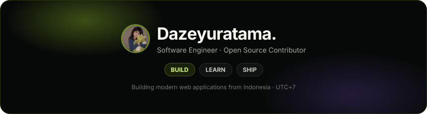
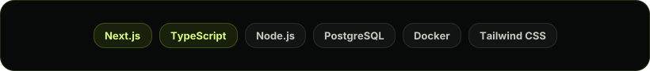

# Dazeyuratama.

<p align="center">
  Software Engineer · Open Source Contributor · Builder
</p>

[](https://www.dazeyuratama.engineer)

## `~/whoami`

```text
Name      : Dazeyuratama.
Focus     : Software Engineering
Style     : Black & Lime Minimalist
Based     : Indonesia · UTC+7
Status    : Building, learning, shipping.
```

I build modern web applications with a focus on clean interfaces, practical engineering, and projects that are meant to be used—not just shown.

## `~/stack`



## `~/connect`

<p align="center">Find me around the internet.</p>

<p align="center">
<a href="https://github.com/udarakasalife"></a><a href="https://www.dazeyuratama.engineer"></a><a href="https://www.instagram.com/devxpxnyctrl_/"></a><a href="https://ko-fi.com/dazeyuratama"></a>
</p>

## `~/support`

If my work is useful to you, you can support my projects and future experiments on Ko-fi.

[](https://ko-fi.com/dazeyuratama)

<p align="center">
  <sub>black & lime — always minimal, always building.</sub>
</p>
